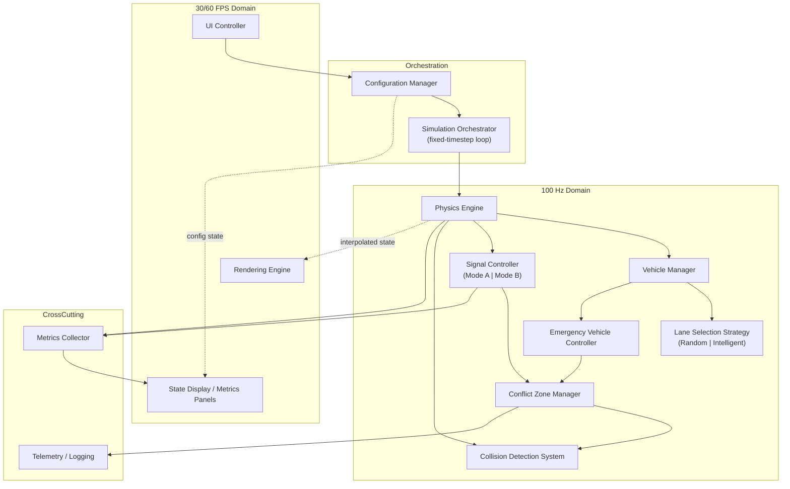

# System Architecture: Realtime Crossroad Simulation System

**Version**: 0.2.0
**Status**: 🟡 PROPOSED (awaiting System Architect + stakeholder sign-off)
**Input Specification**: `specs/requirements/001-012`, `specs/blocking/BF-001..003`, `specs/major/MF-001..006`
**Companion Documents**: [INTERFACES.md](INTERFACES.md), [ADRs/](ADRs/)

---

## 1. Purpose & Constraints

This document decomposes the approved specification (a left-hand-drive, 4-way crossroad
simulation with configurable signal coordination, emergency vehicles, and real-time
UI/metrics) into components, interfaces, and design patterns. No production code is
included — only structure, contracts, and rationale.

**Non-negotiable constraints inherited from the specification**:

- Physics simulation **always** ticks at 100 Hz, decoupled from rendering (30/60 FPS) — [REQ-020](../specs/requirements/004-REQ-020-configurable-frame-rate.md)
- Signal coordination mode is selected at startup and **immutable at runtime** — [REQ-005](../specs/requirements/002-REQ-005-signal-coordination.md)
- Mode B (opposing-simultaneous) **cannot** be enabled without the Conflict Zone Manager active — [REQ-NEW-COLLISION-PREVENTION-1](../specs/requirements/010-REQ-NEW-COLLISION-PREVENTION-1-safe-opposing-green.md)
- Single 4-way intersection only; no multi-intersection networks — [001-scope-and-non-scope](../specs/requirements/001-scope-and-non-scope.md)

---

## 2. Technology Stack

See [ADR-001](ADRs/ADR-001-technology-stack.md) for full rationale. Summary:

| Layer | Choice | Rationale |
| --- | --- | --- |
| Language | **TypeScript** | Static typing for a system with many enums/state machines (signal states, vehicle types, strategies); compiles to browser or Node.js |
| Rendering | **HTML5 Canvas 2D** (top-down view) | Sufficient for a top-down intersection view; avoids 3D engine overhead; matches REQ-020's frame-rate/CPU targets |
| Runtime | **Browser (primary) / Node.js (headless simulation & tests)** | Enables UI controls (REQ-027) in-browser; enables headless deterministic test runs (REQ-020 determinism tests) |
| Build/Test | Node.js 18+, npm scripts | Matches existing repository prerequisites (see [README.md](../README.md)) |
| State management | Plain TypeScript classes + event emitter (no framework) | Simulation state is server-of-truth; UI is a thin observer — avoids coupling simulation correctness to a UI framework's lifecycle |

---

## 3. System Decomposition

### 3.1 Component Map

### 3.2 Component Responsibilities

| Component | Responsibility | Primary Requirements |
| --- | --- | --- |
| **Simulation Orchestrator** | Owns the fixed-timestep loop; ticks Physics Engine at exactly 100 Hz; schedules render callbacks at 30/60 FPS independently; accumulates leftover time (accumulator pattern) | REQ-020 |
| **Configuration Manager** | Single source of truth for all runtime/startup parameters; validates ranges; enforces which parameters are startup-only vs runtime-modifiable; applies scenario presets | REQ-027, MF-005, MF-006, NF-003 |
| **Physics Engine** | Advances vehicle kinematics, applies speed/lane-change constraints, invokes Collision Detection each tick; deterministic given identical inputs regardless of render rate | REQ-020, REQ-007 |
| **Vehicle Manager** | Vehicle spawn/lifecycle (regular + emergency), entry-point distribution, applies Lane Selection Strategy, delegates emergency-specific behavior to Emergency Vehicle Controller | REQ-007, REQ-NEW-E1, REQ-NEW-E5, MF-002 |
| **Lane Selection Strategy** | Pluggable strategy: `RandomLaneStrategy` or `IntelligentLaneStrategy`; selected once at startup | REQ-007 |
| **Signal Controller** | State machine for signal state per direction; pluggable coordination strategy: `StrictMutualExclusionMode` or `OpposingSimultaneousMode` | REQ-005 |
| **Conflict Zone Manager** | Tracks conflict-zone occupancy; grants/denies entry; detects and recovers from deadlock per the conservative recovery procedure | REQ-NEW-COLLISION-PREVENTION-1, BF-003 |
| **Collision Detection System** | Vehicle-vehicle and vehicle-infrastructure contact detection; reports collision events to Metrics/Telemetry | 001-scope, REQ-NEW-COLLISION-PREVENTION-1 |
| **Emergency Vehicle Controller** | Per-type spawn timing (Poisson process), visual marker assignment, signal-override decision, yielding-radius broadcast to nearby regular vehicles | REQ-NEW-E1..E5, MF-002 |
| **Rendering Engine** | Draws interpolated physics state at the configured frame rate; never mutates simulation state | REQ-020, REQ-NEW-E2 |
| **UI Controller** | Renders/handles scenario dropdown, radio buttons, sliders, playback controls; writes only to Configuration Manager | REQ-027, MF-005, MF-006 |
| **State Display / Metrics Panels** | Renders the 5 display panels (Configuration, Traffic, Signal, Collision, Performance) at 10 Hz | REQ-028 |
| **Metrics Collector** | Computes throughput (rolling 60 s window), collision-free ratio, average speed using MF-001 formulas | REQ-028, MF-001 |
| **Telemetry / Logging** | Records deadlock events, collision events, configuration-rejection events | REQ-005, REQ-NEW-COLLISION-PREVENTION-1 |

---

## 4. Design Patterns & Rationale

| Pattern | Applied To | Why |
| --- | --- | --- |
| **Fixed-timestep loop with accumulator** | Simulation Orchestrator | Only pattern that satisfies REQ-020's hard requirement of 100 Hz physics fully decoupled from 30/60 FPS rendering; see [ADR-002](ADRs/ADR-002-fixed-timestep-loop.md) |
| **Strategy Pattern** | Signal Controller (Mode A/B), Lane Selection (Random/Intelligent) | Both are mutually-exclusive, startup-selected, swappable algorithms behind a common interface — textbook Strategy Pattern use case; see [ADR-003](ADRs/ADR-003-signal-coordination-strategy.md), [ADR-005](ADRs/ADR-005-lane-selection-strategy.md) |
| **State Machine** | Signal Controller per-direction state (RED/GREEN/AMBER), Vehicle lifecycle, Conflict Zone occupancy | Requirements explicitly specify states and transitions (REQ-005, REQ-NEW-COLLISION-PREVENTION-1) — modeling as explicit state machines keeps transitions auditable/testable |
| **Observer / Event Emitter** | Metrics Collector, State Display, Telemetry subscribing to Physics Engine and Signal Controller events | Decouples cross-cutting concerns (display, logging) from simulation core; UI never blocks physics |
| **Entity-Component (lightweight)** | Vehicle representation (regular vs. emergency variants share base kinematics + optional `EmergencyBehavior` component) | Avoids deep inheritance hierarchies for the 3 emergency subtypes; matches REQ-NEW-E1's "independent types, shared base behavior" model |
| **Repository/Config Object** | Configuration Manager | Single validated object tree is easier to snapshot for scenario presets (MF-005) and to display in the Configuration Panel (REQ-028) |

---

## 5. Scalability Approach

| Concern | Approach | Requirement |
| --- | --- | --- |
| Vehicle count (200+ regular + up to 60/min emergency) | Flat arrays/typed structures per system (not per-vehicle objects with heavy allocation); spatial partitioning (grid) for collision broad-phase to keep collision checks sub-linear | REQ-020 stress test (150+ vehicles at 60 FPS) |
| Emergency spawn ceiling | Hard cap of 60 veh/min total (20 × 3 types) enforced in Configuration Manager, not just Emergency Vehicle Controller, so misconfiguration is rejected at the source | REQ-NEW-E5, MF-002 |
| Rendering under load | Renderer reads only the latest interpolated snapshot; if a frame budget is exceeded, it skips drawing (never blocks physics) | REQ-020 |
| Display panel cost | Metrics computed once at 10 Hz (not per-render-frame) and cached; Renderer/State Display read the cache | REQ-028 |

---

## 6. Performance Strategy

| Target | Mechanism |
| --- | --- |
| Physics @ 100 Hz ± 2 Hz | Accumulator loop with capped catch-up (max 5 physics ticks per orchestrator iteration) to avoid the "spiral of death" under load |
| Render @ 30 FPS ±3 ms / 60 FPS ±2 ms | Renderer uses `requestAnimationFrame` (browser) gated by an internal frame-rate limiter comparing elapsed time to target frame duration |
| Collision detection latency ≤ 100 ms | Broad-phase spatial grid (cell size ≈ conflict-zone size, 25 m) + narrow-phase AABB check, executed every physics tick |
| Memory <500 MB / CPU <80% (REQ-028 thresholds) | Object pooling for vehicles (reuse on despawn instead of GC churn) |

---

## 7. Requirement → Architecture Traceability

| Requirement | ADR | Owning Component(s) |
| --- | --- | --- |
| [001-scope-and-non-scope](../specs/requirements/001-scope-and-non-scope.md) | ADR-001 | (System-wide constraints) |
| [REQ-005 Signal Coordination](../specs/requirements/002-REQ-005-signal-coordination.md) | ADR-003 | Signal Controller |
| [REQ-007 Lane Selection](../specs/requirements/003-REQ-007-vehicle-lane-selection.md) | ADR-005 | Vehicle Manager, Lane Selection Strategy |
| [REQ-020 Configurable Frame Rate](../specs/requirements/004-REQ-020-configurable-frame-rate.md) | ADR-002 | Simulation Orchestrator, Rendering Engine |
| [REQ-NEW-E1 Emergency Types](../specs/requirements/005-REQ-NEW-E1-emergency-vehicle-types.md) | ADR-006 | Emergency Vehicle Controller |
| [REQ-NEW-E2 Visual Markers](../specs/requirements/006-REQ-NEW-E2-emergency-visual-markers.md) | ADR-006 | Rendering Engine, Emergency Vehicle Controller |
| [REQ-NEW-E3 Signal Override](../specs/requirements/007-REQ-NEW-E3-signal-override.md) | ADR-006 | Emergency Vehicle Controller, Conflict Zone Manager |
| [REQ-NEW-E4 Yielding Behavior](../specs/requirements/008-REQ-NEW-E4-yielding-behavior.md) | ADR-006 | Vehicle Manager, Emergency Vehicle Controller |
| [REQ-NEW-E5 Emergency Spawn Rate](../specs/requirements/009-REQ-NEW-E5-emergency-spawn-rate.md) | ADR-006 | Emergency Vehicle Controller, Configuration Manager |
| [REQ-NEW-COLLISION-PREVENTION-1](../specs/requirements/010-REQ-NEW-COLLISION-PREVENTION-1-safe-opposing-green.md) | ADR-004 | Conflict Zone Manager, Collision Detection System |
| [REQ-027 UI Controls](../specs/requirements/011-REQ-027-ui-controls.md) | ADR-007 | UI Controller, Configuration Manager |
| [REQ-028 State Display](../specs/requirements/012-REQ-028-state-display.md) | ADR-008 | State Display, Metrics Collector |
| [BF-002 Numbering Scheme](../specs/blocking/BF-002-establish-numbering-scheme.md) | ADR-009 | (Documentation/code-module convention) |
| [BF-003 Deadlock Semantics](../specs/blocking/BF-003-clarify-deadlock-semantics.md) | ADR-004 | Conflict Zone Manager |
| [MF-002 Spawn Collision Handling](../specs/major/MF-002-emergency-spawn-collision-handling.md) | ADR-006 | Vehicle Manager, Emergency Vehicle Controller |
| [MF-005 Scenario Presets](../specs/major/MF-005-scenario-preset-completeness.md) | ADR-007 | Configuration Manager |
| [MF-006 Emergency UI Model](../specs/major/MF-006-emergency-ui-consistency.md) | ADR-007 | UI Controller |
| [MF-001 Metric Calculations](../specs/major/MF-001-precision-metric-calculations.md) | ADR-008 | Metrics Collector |

**Coverage check**: ✅ All 12 core requirement files + the 3 blocking findings + the 3 major
findings with architectural impact (MF-001, MF-002, MF-005, MF-006) are mapped to at least
one ADR and one owning component. MF-003 (terminology), MF-004 (naming), and NF-001..005
are documentation/naming conventions with no independent architectural component — they are
applied throughout this document and the ADRs (e.g., "Conflict Zone" terminology, uppercase
signal state constants).

---

## 8. Open Items Carried From Specification Review

These are **not** blocking for the architecture (interfaces below accommodate either
resolution), but must be resolved before implementation tasks are finalized:

- **BF-001** (missing requirements extraction): architecture assumes the 12 documented
  requirements are complete for v0.2.0 scope; if additional requirements are extracted,
  re-run the traceability check in §7.
- **BF-002** (numbering scheme): this document and [ADR-009](ADRs/ADR-009-requirement-traceability-convention.md)
  assume Option A (sequential `REQ-001..NNN`) will be adopted; component/module names are
  chosen to be numbering-scheme-agnostic (named by responsibility, not REQ ID).

---

## 9. Sign-Off

| Role | Status |
| --- | --- |
| Requirements Engineer | ⏳ PENDING |
| System Architect | ⏳ PENDING |
| QA Lead | ⏳ PENDING |

**Next Phase**: Step 5 — Create Tasks (`/05-create-tasks`)
