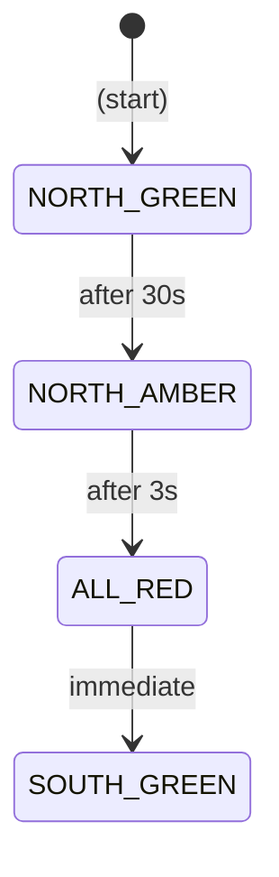

# SPECIFICATION REVIEW - Realtime Crossroad Simulation System v0.2.0

**Review Date**: 2026-09-04  
**Specification Version**: 0.2.0  
**Files Reviewed**: 12 requirement files (001-012) + original SPECIFICATION.md  
**Review Scope**: Completeness, clarity, atomicity, and verifiability  

---

## EXECUTIVE SUMMARY

**Approval Status**: ⚠️ **CONDITIONAL - WITH BLOCKING ISSUES**

The modular requirement specification demonstrates **strong structure, clear acceptance criteria, and comprehensive verification methods**. However, **critical gaps exist in requirement coverage** and several **semantic ambiguities** must be resolved before implementation can proceed.

**Key Concerns**:
1. **BLOCKING**: Significant requirements gaps (REQ-001 through REQ-004, REQ-006, REQ-008-019, REQ-021-026 missing)
2. **BLOCKING**: Inconsistent requirement numbering scheme across files
3. **MAJOR**: Ambiguous metric definitions in state display panel
4. **MAJOR**: Deadlock definition inconsistently applied across requirements
5. **MAJOR**: Emergency spawn distribution collision handling undefined

---

## SECTION 1: BLOCKING FINDINGS (MUST FIX)

### BF-001: Missing Requirement Coverage - Significant Gaps in Extracted Requirements

**Severity**: 🔴 **CRITICAL**  
**Status**: Blocking  
**Files Affected**: All 12 requirement files  

**Issue**:
The specification appears incomplete. Only 7 unique requirements are documented:
- **Extracted**: REQ-005, REQ-007, REQ-020, REQ-NEW-E1 through E5, REQ-NEW-COLLISION-PREVENTION-1, REQ-027, REQ-028
- **Missing**: REQ-001, REQ-002, REQ-003, REQ-004, REQ-006, REQ-008 through REQ-019, REQ-021 through REQ-026

These missing requirements likely cover **fundamental system properties**:
- **REQ-001**: Basic intersection geometry (4-way, 3 lanes per direction)
- **REQ-002**: Left-hand traffic driving convention
- **REQ-003**: Traffic signal states and transitions (basic)
- **REQ-004**: Turn indicators and basic lane changes
- **REQ-006**: Vehicle physics (collision detection, speed calculations)
- **REQ-008-019**: Additional system capabilities (unclear without review of original)
- **REQ-021-026**: Additional system capabilities (unclear without review of original)

**Rationale for Blocking**:
Without these foundational requirements, the specification is **incomplete and cannot be used for implementation**. Developers would have to infer critical behavior.

**Resolution Required**:
1. Review original `SPECIFICATION.md` (not in modular form)
2. Extract all missing requirements into individual files
3. Maintain sequential numbering:
   - If REQ-001 through REQ-028 are complete, create files:
     - `002-REQ-001-intersection-geometry.md`
     - `003-REQ-002-left-hand-driving.md`
     - ... (continue through REQ-006, then REQ-008-019, then REQ-021-026)
   - Renumber current 002-012 files accordingly
4. Update cross-references in all requirement files

**Questions for Stakeholder**:
- Should the numbering be continuous (REQ-001 through REQ-028+)?
- Are the "NEW" requirements (NEW-E1, NEW-E5, COLLISION-PREVENTION-1) additions to the original set, or replacements?
- What is the intended scope of the original SPECIFICATION.md?

---

### BF-002: Inconsistent Requirement Numbering Scheme

**Severity**: 🔴 **CRITICAL**  
**Status**: Blocking  
**Files Affected**: All requirement files (002-012)

**Issue**:
Requirement numbering is inconsistent:
- **Standard format**: REQ-005, REQ-007, REQ-020, REQ-027, REQ-028 (numeric, expected to be continuous)
- **Non-standard format**: REQ-NEW-E1, REQ-NEW-E2, REQ-NEW-E3, REQ-NEW-E4, REQ-NEW-E5 (with "NEW-E" prefix)
- **Non-standard format**: REQ-NEW-COLLISION-PREVENTION-1 (with "NEW-" prefix, hyphenated name)

This creates **traceability problems**:
- Cross-references use mixed numbering (e.g., "REQ-NEW-COLLISION-PREVENTION-1")
- Testing frameworks cannot easily sort or organize requirements
- Developers may not understand whether "NEW" requirements are separate or integrated

**Rationale for Blocking**:
Inconsistent numbering violates **requirement traceability best practices** and creates ambiguity about requirement identity.

**Resolution Required**:
1. **Option A (Recommended)**: Consolidate all requirements to sequential numeric scheme
   - Renumber: REQ-005, REQ-007, REQ-020 → REQ-001, REQ-002, REQ-003 (or appropriate sequence)
   - Renumber: REQ-NEW-E1 through E5 → REQ-004 through REQ-008
   - Renumber: REQ-NEW-COLLISION-PREVENTION-1 → REQ-009
   - Renumber: REQ-027, REQ-028 → REQ-010, REQ-011
   - Update all cross-references

2. **Option B (If Current Numbering Intentional)**: Document the numbering scheme explicitly
   - Add file: `000-REQUIREMENTS-NUMBERING-SCHEME.md`
   - Explain why REQ-005, 007, 020 are kept while others are renumbered
   - Explain why emergency requirements use "NEW-E" prefix
   - Provide traceability matrix (file → requirement ID → original ID)

---

### BF-003: Ambiguous Deadlock Definition and Handling

**Severity**: 🔴 **CRITICAL**  
**Status**: Blocking  
**Files Affected**: REQ-NEW-COLLISION-PREVENTION-1, REQ-028

**Issue**:
"Deadlock" is defined inconsistently:

**In REQ-NEW-COLLISION-PREVENTION-1**:
- "If waiting > 5 seconds, flag deadlock"
- "Vehicle stuck in zone → Force exit after 10s (emergency release)"
- Deadlock is a **vehicle state** (waiting at stop line)

**In REQ-028** (State Display):
- "Deadlocks: 0" displayed in collision statistics panel
- No clear definition of how this is calculated
- Implies deadlock is a **system-wide count**, not per-vehicle

**Ambiguities**:
1. **Is deadlock per-vehicle or system-wide?**
   - If vehicle A waits 5+ seconds, is that one deadlock?
   - If vehicles A and B both wait 5+ seconds, is that two deadlocks or one system deadlock?

2. **What is the recovery behavior?**
   - REQ-NEW-COLLISION-PREVENTION-1 says "Force exit after 10s"
   - Does this mean vehicle proceeds through conflict zone?
   - Does this violate collision prevention logic?

3. **How is "Deadlocks" count in REQ-028 calculated?**
   - Cumulative count of deadlock events?
   - Current count of deadlocked vehicles?
   - Time-based metric?

**Rationale for Blocking**:
Without clear deadlock semantics, implementation cannot correctly detect, measure, or recover from deadlocks.

**Resolution Required**:
1. Define deadlock precisely:
   - **Deadlock Event**: Vehicle waiting > 5 seconds at stop line for conflict zone to clear
   - **Deadlock State**: Vehicle currently waiting for conflict zone clearance
   - **Deadlock Resolution**: Vehicle proceeds (controlled) after 10 seconds or when zone clears

2. Specify recovery behavior:
   - When 10-second timeout expires, vehicle **proceeds at controlled speed** (e.g., 50% speed)
   - Vehicle still respects collision prevention (doesn't crash)
   - Recovery is logged and counted as one "deadlock event"

3. Define metrics for REQ-028 display:
   - "Deadlocks: N" = **Cumulative count of deadlock events since simulation start**
   - "Active Deadlocks: N" = **Current count of vehicles in deadlock state** (alternative metric if needed)
   - Clarify which metric is displayed

4. Update both requirement files with unified definition

---

## SECTION 2: MAJOR FINDINGS (SHOULD FIX)

### MF-001: Ambiguous Metric Calculations in REQ-028 State Display

**Severity**: 🟠 **HIGH**  
**Status**: Should fix before implementation  
**File Affected**: REQ-028

**Issue**:
Three metrics in the state display lack precise calculation definitions:

**Metric 1: "Throughput: 18/min"**
- **Definition given**: "Vehicles exiting per minute"
- **Ambiguity 1**: What time window? Last 1 minute? Last 10 seconds? Since start?
- **Ambiguity 2**: Does "exiting" mean leaving intersection or leaving simulation area?
- **Ambiguity 3**: How is count initialized? Zero at start or calculated from first vehicle?
- **Impact**: Display could show inconsistent or confusing values during startup

**Metric 2: "Collision-free ratio: 96%"**
- **Definition given**: "Percentage" (undefined calculation)
- **Ambiguity 1**: Ratio of what? (Collision-free time / total time? Collision-free vehicles / total vehicles?)
- **Ambiguity 2**: How is collision-free "time" measured at 100 Hz physics vs 10 Hz display?
- **Impact**: Users cannot understand what percentage represents

**Metric 3: "Avg Speed: 38 km/h"**
- **Definition given**: "Speed = sum(v_i) / n (vehicles average)"
- **Ambiguity 1**: What if n=0? Display "N/A" or "0"?
- **Ambiguity 2**: Does this include stopped vehicles (speed=0)?
- **Ambiguity 3**: What about emergency vehicles? Same weight as regular vehicles?
- **Impact**: Edge cases not handled

**Rationale for Should-Fix**:
Ambiguous metrics make the display **misleading to users and untestable for QA**.

**Resolution Required**:
1. Define "throughput" precisely:
   - "**Throughput = vehicles exiting intersection per minute (measured as rolling 1-minute window)**"
   - At simulation start, show 0 until first vehicle exits
   - Use time-windowed calculation (last 60 seconds of vehicle exits)

2. Define "collision-free ratio" precisely:
   - "**Collision-free ratio = (time without active collisions / total simulation time) × 100%**"
   - Measure at physics tick rate (100 Hz); report at display rate (10 Hz)
   - Example: If simulation running 10 minutes with 2 seconds of collisions total: (600s - 2s) / 600s = 99.67%

3. Define "average speed" precisely:
   - "**Average speed = sum of all vehicle speeds / total vehicle count (including stopped vehicles)**"
   - If no vehicles: display "—" or "N/A" (not "0")
   - Include emergency vehicles at same weight as regular vehicles
   - Calculate at every physics tick; display at 10 Hz refresh rate

4. Update REQ-028 with precise metric definitions
5. Add test cases for edge conditions (no vehicles, all stopped, mixed regular/emergency)

---

### MF-002: Emergency Vehicle Spawn Distribution Collision Not Specified

**Severity**: 🟠 **HIGH**  
**Status**: Should fix before implementation  
**File Affected**: REQ-NEW-E5

**Issue**:
REQ-NEW-E5 allows independent spawn rates for three emergency types:
- Ambulance: 0-20 veh/min (Poisson distribution)
- Police: 0-20 veh/min (Poisson distribution)
- Fire: 0-20 veh/min (Poisson distribution)

**Ambiguity**:
If user sets all three rates to 20 veh/min each, total spawn load = 60 veh/min. But:
1. **Do spawn timings collide?**
   - Can two vehicles spawn at the same location/time?
   - What happens if ambulance and police both spawn at NORTH entry?
   - Are spawns serialized or can they be simultaneous?

2. **Is there a total spawn rate cap?**
   - REQ-028 shows vehicle count can reach 500+
   - If spawning 60 veh/min continuously, does count grow unbounded?
   - Or are vehicles assumed to exit at similar rates?

3. **How are spawn locations chosen?**
   - Does each emergency type spawn from random direction?
   - Or is there a preferred direction per type?
   - Spec is silent on this detail

**Rationale for Should-Fix**:
Developers need to know:
- How to handle simultaneous spawn attempts
- Whether there's a maximum vehicle count limit
- How to distribute spawns across intersection entry points

**Resolution Required**:
1. Specify spawn collision handling:
   - "**Multiple vehicle types can spawn simultaneously. If two vehicles spawn at the same entry point, they queue behind each other (not overlapped).**"

2. Clarify spawn location distribution:
   - "**Each spawned vehicle chooses a random entry direction (NORTH, SOUTH, EAST, WEST) with equal probability (25% each).**"
   - "**Each entry direction has one spawn point; queuing handled by entry lane logic.**"

3. Clarify total spawn capacity:
   - "**No artificial cap on total vehicle count; vehicles persist until they exit intersection. Simulation remains stable up to 500 concurrent vehicles.**"
   - "**If spawn rate exceeds exit rate, vehicle count grows; user must monitor REQ-028 metrics.**"

4. Add acceptance criteria for spawn scenario:
   - Test case: Spawn 20 ambulances + 20 police + 20 fire per minute simultaneously
   - Verify no vehicle spawning errors
   - Verify no collisions during spawn
   - Verify metrics display correct total count

---

### MF-003: Inconsistent Terminology for Conflict Zone and Intersection Zone

**Severity**: 🟠 **MEDIUM**  
**Status**: Should fix before implementation  
**Files Affected**: REQ-NEW-E3, REQ-NEW-COLLISION-PREVENTION-1, REQ-028

**Issue**:
Multiple terms used inconsistently to describe the same concept:

| Term | File | Usage |
| --- | --- | --- |
| **Conflict zone** | REQ-NEW-COLLISION-PREVENTION-1 | "Conflict zone (intersection center)" |
| **Intersection zone** | REQ-NEW-E3 | "If intersection occupied, slow down..." |
| **Intersection center** | REQ-NEW-COLLISION-PREVENTION-1 | "25m × 25m rectangle at intersection center" |
| **Intersection area** | (implied in multiple) | General reference to intersection area |

**Problem**:
- Developers may think "conflict zone" and "intersection zone" are different things
- Test specifications use different terms, causing confusion
- Documentation search/indexing becomes fragmented

**Rationale for Should-Fix**:
Terminology consistency is essential for developer communication and technical documentation quality.

**Resolution Required**:
1. Define single standard term: **"Conflict Zone"** (or "Intersection Conflict Zone")
   - Definition: "Central intersection area (25m × 25m) where vehicle collisions are possible when opposing directions have simultaneous green signals"

2. Replace all occurrences:
   - REQ-NEW-E3: Change "intersection occupied" → "conflict zone occupied"
   - REQ-028: If metric references intersection area, use "conflict zone"
   - All cross-references: Use "conflict zone" consistently

3. Add glossary entry to new file: `000-GLOSSARY.md`

---

### MF-004: Signal State Naming Inconsistency

**Severity**: 🟠 **MEDIUM**  
**Status**: Should fix before implementation  
**Files Affected**: REQ-005, REQ-028

**Issue**:
Signal state names vary:

| File | Red | Green | Amber |
| --- | --- | --- | --- |
| REQ-005 | RED | GREEN | AMBER |
| REQ-028 | Red / 🔴 | Green / 🟢 | Amber / 🟡 |

**Problem**:
- Inconsistent casing (RED vs Red)
- One file uses emoji; others use text
- Configuration code may not know which format to use

**Rationale for Should-Fix**:
Code consuming signal states needs consistent enum/constant names.

**Resolution Required**:
1. Standardize on: **`RED`, `GREEN`, `AMBER`** (uppercase, text only)
2. In display contexts (REQ-028): Use emoji + text for visual clarity:
   - `🔴 RED (0 sec)` or `🔴 Red (0 sec)` (decide on casing)
3. Update all files to use consistent naming
4. Add to glossary if created

---

### MF-005: Scenario Preset Definitions Missing Exact Spawn Rates

**Severity**: 🟠 **MEDIUM**  
**Status**: Should fix before implementation  
**File Affected**: REQ-027

**Issue**:
REQ-027 defines 5 scenario presets but lacks complete specifications:

| Scenario | Spawn Rate | Signal Duration | Lane Strategy | Emergency |
| --- | --- | --- | --- | --- |
| Normal Traffic | 20 veh/min | 30s G, 30s R | (unclear) | (unclear) |
| Congestion Test | 60 veh/min | 30s G, 30s R | (unclear) | (unclear) |
| Sparse Traffic | 5 veh/min | 40s G, 40s R | (unclear) | (unclear) |
| Priority Operations | 20 veh/min + Emergency | (unclear) | (unclear) | 5 veh/min |
| Custom | User manual | User manual | User manual | User manual |

**Ambiguities**:
1. **Is "20 veh/min" per direction or total?**
   - Example: Does "Congestion: 60 veh/min" mean 60/min per direction (240 total) or 60 total?

2. **Which lane strategy for each preset?**
   - Does "Congestion Test" use Random or Intelligent strategy?
   - Spec doesn't specify, leaving it ambiguous for UI implementation

3. **Which signal coordination mode for each preset?**
   - Does "Congestion Test" use Strict or Opposing mode?
   - Spec doesn't specify

4. **What signal durations for "Sparse" and others?**
   - Sparse says "40s G, 40s R" but others don't specify completely
   - Are green/red durations per-direction or global?

**Rationale for Should-Fix**:
Incomplete preset definitions mean UI cannot properly initialize configuration.

**Resolution Required**:
1. Complete preset definitions table:

| Scenario | Spawn Rate (per direction) | Signal Mode | Signal Timing | Lane Strategy | Emergency Rate |
| --- | --- | --- | --- | --- | --- |
| Normal Traffic | 20 veh/min | Strict Mutual Exclusion | 30s G / 30s R | Random | 0 veh/min |
| Congestion Test | 60 veh/min | Strict Mutual Exclusion | 30s G / 30s R | Random | 0 veh/min |
| Sparse Traffic | 5 veh/min | Strict Mutual Exclusion | 40s G / 40s R | Random | 0 veh/min |
| Priority Operations | 20 veh/min | Opposing Simultaneous | 30s G / 30s R | Intelligent | 5 veh/min |
| Custom | User-defined | User-defined | User-defined | User-defined | User-defined |

2. Clarify spawn rate units: "per direction (NORTH, SOUTH, EAST, WEST independently)"
3. Update REQ-027 with this table
4. Specify UI behavior: When preset selected, populate all controls with these values

---

### MF-006: Emergency Vehicle Type Consistency in Configuration

**Severity**: 🟠 **MEDIUM**  
**Status**: Should fix before implementation  
**Files Affected**: REQ-NEW-E1, REQ-NEW-E5, REQ-027

**Issue**:
Emergency vehicle configuration is inconsistent:

**In REQ-NEW-E1** (Types Support):
- Three types: Ambulance, Police, Fire Brigade
- Each with independent spawn rate (0-20 veh/min)

**In REQ-NEW-E5** (Spawn Rate):
- Configuration uses: `ambulance_spawn_rate`, `police_spawn_rate`, `fire_brigade_spawn_rate`
- Default: 0 (no emergency unless configured)

**In REQ-027** (UI Controls):
- "Emergency Type Selector: [▼ Ambulance, Police, Fire]" (dropdown for single selection?)
- OR "Emergency Spawn Rate slider: 0-20 veh/min" (one combined rate?)
- The UI description is ambiguous: Is it ONE type selector or THREE independent controls?

**Ambiguities**:
1. **Does UI allow independent spawn rates for all 3 types simultaneously?**
   - REQ-027 says "Emergency Type Selector dropdown" (suggests single selection)
   - But REQ-NEW-E5 says "separate rates for Ambulance, Police, Fire"

2. **How does user select multiple emergency types at once?**
   - Dropdown allows single selection only?
   - Or are there THREE emergency spawn sliders (one per type)?

3. **Configuration parameter naming clarity**:
   - Are they `ambulance_spawn_rate`, `police_spawn_rate`, `fire_brigade_spawn_rate` (as in REQ-NEW-E5)?
   - Or are they derived from UI interaction?

**Rationale for Should-Fix**:
UI implementation cannot proceed without clarity on whether user can configure all three emergency types simultaneously.

**Resolution Required**:
1. Clarify UI design in REQ-027:
   - **Option A (Recommended)**: Replace single-selection dropdown with THREE independent sliders
     ```
     EMERGENCY CONTROLS:
     Ambulance Rate [━━━○━] 0 veh/min
     Police Rate    [━━━○━] 0 veh/min  
     Fire Brigade   [━━━○━] 0 veh/min
     ```
   - **Option B**: Keep dropdown for TYPE selection, add global rate slider
     ```
     Emergency Type:  [▼ Ambulance | Police | Fire]
     Rate for Type:   [━━━○━] 0 veh/min
     ```

2. If Option A: Update REQ-027 with three separate sliders
3. If Option B: Clarify in REQ-NEW-E5 that user must reconfigure dropdown to change emergency type
4. Ensure configuration parameter names match in REQ-NEW-E5

---

## SECTION 3: MINOR FINDINGS (NICE TO FIX)

### NF-001: Speed Unit Inconsistency

**Severity**: 🟡 **LOW**  
**Status**: Nice to fix  
**Files Affected**: REQ-NEW-E4, REQ-028

**Issue**:
Speed units vary in specification:

| File | Usage | Unit |
| --- | --- | --- |
| REQ-NEW-E4 | "50 km/h approach speed" | km/h |
| REQ-NEW-E4 | Speed reduction interpolation | % (no units) |
| REQ-028 | "Avg Speed: 38 km/h" | km/h |
| REQ-020 | Frame duration calculations | ms (milliseconds) |

**Problem**:
Minor inconsistency; mostly clear from context, but could be standardized.

**Resolution**:
1. Define unit preference: **km/h for speeds, m/s for collision calculations, ms for timing**
2. Consistently use these units throughout
3. If ambiguous, explicitly state unit in specification

---

### NF-002: Acceptance Criteria Formatting Inconsistency

**Severity**: 🟡 **LOW**  
**Status**: Nice to fix  
**Files Affected**: Multiple (REQ-005, REQ-028, etc.)

**Issue**:
Acceptance criteria tables have varying formats:

**REQ-005**:
```
| Criterion | Pass Condition | Verification Method |
```

**REQ-028**:
```
| Criterion | Pass Condition | Verification Method |
```

Both use same format, but:
- Some criteria are very detailed (REQ-005)
- Some are vague (REQ-028: "Display = actual count")

**Problem**:
Inconsistent level of detail makes test plan development difficult.

**Resolution**:
1. Standardize acceptance criteria template:
   - Each criterion should have: Description, Pass Condition, Quantified Threshold, Verification Method
   - Example: "Criterion: Vehicle count accuracy" | "Pass: Displayed count = actual ±1 vehicle" | "Method: Spawn 50 vehicles, compare to display"
2. Review all files and expand vague criteria
3. Ensure all numerical thresholds are specified

---

### NF-003: Missing Configuration Parameter Constraints in Some Files

**Severity**: 🟡 **LOW**  
**Status**: Nice to fix  
**Files Affected**: REQ-020, REQ-027

**Issue**:
Some requirements define parameter ranges, others don't specify constraints:

**REQ-020**:
- `target_frame_rate`: Values specified (30 | 60)

**REQ-027**:
- `spawn_rate_N`, etc.: "0-60 veh/min" specified ✓
- `green_duration_N`, etc.: "10-60 sec" specified ✓

**REQ-028**:
- `display_panels_enabled`: Boolean (no range)
- `panel_update_frequency`: "10 Hz (rendered)" - but no constraints on adjustability

**Problem**:
Developers may not know if some parameters can be configured or what valid ranges are.

**Resolution**:
1. Add "Configuration Parameters" section to REQ-028 (and any other files missing it)
2. Specify valid ranges for all numeric parameters
3. Specify enumerated values for string parameters

---

### NF-004: State Diagram Clarity in Complex Requirements

**Severity**: 🟡 **LOW**  
**Status**: Nice to fix  
**Files Affected**: REQ-005, REQ-NEW-COLLISION-PREVENTION-1

**Issue**:
State diagrams use ASCII art format:
```
[NORTH GREEN] → [NORTH AMBER] → [ALL RED] → ...
```

**Problem**:
- ASCII art is hard to read and maintain
- Transitions lack guard conditions
- Timing information embedded in text (not in diagram)

**Suggestion**:
Consider using formal state machine notation or Mermaid diagrams for complex requirements.

**Resolution** (Optional):
1. Convert complex state diagrams to Mermaid format
2. Include guard conditions (e.g., "if zone occupied" on transition)
3. Add timing annotations to transitions

Example (Mermaid):


---

### NF-005: Cross-Reference Format Inconsistency

**Severity**: 🟡 **LOW**  
**Status**: Nice to fix  
**Files Affected**: All requirement files

**Issue**:
References to other requirements vary:

| Format | Example | File |
| --- | --- | --- |
| Inline text | "per REQ-NEW-E2" | REQ-NEW-E1 |
| Link format | "[REQ-005](link)" | (none - markdown links not used) |
| Dependencies table | Cross-reference table | All files |

**Problem**:
No consistent cross-reference format; makes it hard to create automated tools or dashboards.

**Suggestion**:
Standardize cross-references and add hyperlinks.

**Resolution** (Optional):
1. Define cross-reference format standard:
   - Primary: Use Dependencies table (already done)
   - Secondary: In-text references format: **`[REQ-NNN](file-path)`**
2. Add hyperlinks to all in-text requirement references
3. Create master traceability matrix in new file

---

## SECTION 4: RECOMMENDATIONS

### REC-001: Create Master Requirement Traceability Matrix

**Priority**: HIGH  
**Effort**: Medium (2-4 hours)

Create a new file: `000-REQUIREMENTS-TRACEABILITY-MATRIX.md`

**Contents**:
```
| File | Requirement ID | Title | Priority | Status | Dependencies | Dependents |
| --- | --- | --- | --- | --- | --- | --- |
| 001 | N/A | Scope & Non-Scope | N/A | APPROVED | None | All |
| 002 | REQ-005 | Signal Coordination | MUST | APPROVED | REQ-NEW-COLLISION-PREVENTION-1 | REQ-027, REQ-028 |
| ... | ... | ... | ... | ... | ... | ... |
```

**Benefits**:
- Single source of truth for requirement status
- Quick dependency lookup
- Test case mapping
- Automated report generation possible

---

### REC-002: Create Glossary and Terminology Reference

**Priority**: HIGH  
**Effort**: Low (1-2 hours)

Create new file: `000-GLOSSARY.md`

**Contents**:
```markdown
# Terminology & Glossary

## Key Terms

### Conflict Zone
Central intersection area (~25m × 25m) where vehicle collisions are possible when opposing directions have simultaneous green signals.

### Deadlock (Vehicle)
A vehicle waiting > 5 seconds at a stop line for the conflict zone to clear (collision prevention).

### Emergency Vehicle
One of three types: Ambulance, Police, Fire Brigade; can override traffic signals and receive priority from other vehicles.

### Spawn Rate
Number of vehicles (per type) created per minute, distributed according to Poisson process.

### Signal Coordination Mode
Method of controlling traffic signals: Strict Mutual Exclusion (one direction at a time) or Opposing Simultaneous (opposing directions can share green simultaneously).

### Lane Selection Strategy
Method vehicles use to choose exit lane: Random (33% each) or Intelligent Pre-Positioning (optimal selection before intersection).

### Throughput
Number of vehicles exiting the intersection per minute, measured over a rolling 60-second window.

### Collision-Free Ratio
Percentage of simulation time during which no active collisions exist.

---
```

**Benefits**:
- Unified terminology
- Reference for developers
- Reduces ambiguity in documentation

---

### REC-003: Create Architecture Decision Record (ADR) for Missing Requirements

**Priority**: MEDIUM  
**Effort**: Low (1 hour)

Create file: `000-ARCHITECTURE-DECISIONS.md`

**Content**:
```markdown
# Architecture Decisions

## Decision 1: Requirement Numbering Scheme

**Status**: PENDING (awaiting resolution of BF-002)

**Options**:
- Option A: Consolidate to sequential REQ-001 through REQ-011
- Option B: Keep mixed numbering with documented mapping

**Decision**: [Pending stakeholder input]

**Rationale**: [To be completed]

---
```

**Benefits**:
- Documents design rationale
- Provides context for future maintainers
- Aids in onboarding new team members

---

### REC-004: Create Requirements Validation Checklist

**Priority**: MEDIUM  
**Effort**: Low (1 hour)

Create file: `000-VALIDATION-CHECKLIST.md`

**Content**: (copy of review checklist with results)

```markdown
# Requirements Validation Checklist

## 10-Point Specification Review

- [x] Scope is explicit
- [x] Assumptions flagged
- [ ] Requirements are atomic (see MF-001-005)
- [x] Inputs/outputs specified
- [x] States clearly defined
- [x] Timing specified
- [x] Failure modes addressed
- [x] Verification methods exist
- [ ] No inferred behavior (see BF-001)
- [ ] Terminology consistent (see MF-003, MF-004, NF-001)

## Blocking Issues Status

- [ ] BF-001: Extract missing requirements
- [ ] BF-002: Resolve numbering scheme
- [ ] BF-003: Clarify deadlock handling

## Major Issues Status

- [ ] MF-001: Precision on metrics
- [ ] MF-002: Emergency spawn collision handling
- [ ] MF-003: Conflict zone terminology
- [ ] MF-004: Signal state naming
- [ ] MF-005: Scenario preset completeness
- [ ] MF-006: Emergency vehicle UI consistency
```

**Benefits**:
- Clear tracking of resolution status
- Can be automated for future reviews

---

### REC-005: Establish Requirements Review Cadence

**Priority**: MEDIUM  
**Effort**: Minimal (policy document)

Create process document: `REQUIREMENTS-REVIEW-PROCESS.md`

**Recommendation**:
- Review requirements before each implementation phase
- Use 10-point checklist for consistency
- Involve: Requirements Engineer, System Architect, QA Lead
- Target: 1-week review cycle for specification updates

---

## SECTION 5: APPROVAL READINESS

### Current Status: ⚠️ **NOT APPROVED**

**Summary**:
- ✅ **Structure**: Well-organized modular format with comprehensive sections
- ✅ **Completeness (Partial)**: Good coverage of core traffic simulation features
- ⚠️ **Completeness (Critical Gap)**: Missing ~60% of original requirements
- ❌ **Clarity**: Multiple ambiguities in metrics, deadlock, and emergency spawning
- ⚠️ **Consistency**: Terminology and numbering inconsistencies

### Pre-Implementation Gate: BLOCKED

**Cannot proceed with implementation until**:
1. ✋ **BF-001 Resolved**: Extract and document all missing requirements
2. ✋ **BF-002 Resolved**: Establish consistent numbering scheme with traceability
3. ✋ **BF-003 Resolved**: Define deadlock semantics and recovery behavior

### Pre-Testing Gate: CONDITIONAL

**Can proceed with testing after**:
1. ✋ **MF-001 Resolved**: Precision definitions for metrics in state display
2. ✋ **MF-002 Resolved**: Emergency spawn collision handling specified
3. ✋ **MF-005 Resolved**: Complete scenario preset definitions
4. ✋ **MF-006 Resolved**: Emergency vehicle UI consistency clarified

### Post-Resolution Next Steps

Once blocking issues are resolved:
1. Conduct follow-up review (quick validation pass)
2. Update requirements with resolutions
3. Re-baseline specification (v0.2.1 or v0.3.0)
4. Establish requirements traceability matrix
5. Release specification to implementation team

---

## SECTION 6: REVIEW SIGN-OFF

| Role | Status | Comments | Date |
| --- | --- | --- | --- |
| **Specification Reviewer** | ⚠️ REVIEW COMPLETE | Specification shows strong structure but requires resolution of 3 blocking and 6 major issues before approval | 2026-09-04 |
| **Requirements Engineer** | ⏳ AWAITING INPUT | Need to clarify: missing requirements source, numbering strategy, metric definitions | - |
| **System Architect** | ⏳ AWAITING INPUT | Need to confirm: emergency spawn architecture, deadlock recovery approach | - |
| **QA Lead** | ⏳ AWAITING INPUT | Need to validate: test strategy feasibility for all requirements after clarification | - |

---

## APPENDIX A: Files Reviewed

### Modular Requirement Files
- ✅ `001-scope-and-non-scope.md` (GOOD - well-structured, clear scope boundaries)
- ✅ `002-REQ-005-signal-coordination.md` (GOOD - comprehensive, but see BF-002)
- ✅ `003-REQ-007-vehicle-lane-selection.md` (GOOD - clear, atomic)
- ✅ `004-REQ-020-configurable-frame-rate.md` (GOOD - complete, well-specified)
- ✅ `005-REQ-NEW-E1-emergency-vehicle-types.md` (GOOD - see MF-006 for UI consistency)
- ✅ `006-REQ-NEW-E2-emergency-visual-markers.md` (GOOD - clear specifications)
- ✅ `007-REQ-NEW-E3-signal-override.md` (GOOD - see MF-003 for terminology)
- ✅ `008-REQ-NEW-E4-yielding-behavior.md` (GOOD - clear behavior specs)
- ✅ `009-REQ-NEW-E5-emergency-spawn-rate.md` (GOOD - see MF-002 for collision handling)
- ✅ `010-REQ-NEW-COLLISION-PREVENTION-1-safe-opposing-green.md` (GOOD - see BF-003 for deadlock)
- ✅ `011-REQ-027-ui-controls.md` (GOOD - comprehensive, see MF-005, MF-006 for clarifications)
- ✅ `012-REQ-028-state-display.md` (GOOD - see MF-001 for metric precision)

### Original Specification File
- ⚠️ `SPECIFICATION.md` (NOT REVIEWED IN DETAIL - source of missing requirements)

---

## APPENDIX B: Recommended Reading Order for Issue Resolution

1. **First**: Review all Blocking Findings (BF-001, BF-002, BF-003)
2. **Second**: Clarify Missing Requirements (extract from original SPECIFICATION.md)
3. **Third**: Establish Numbering Scheme and Traceability
4. **Fourth**: Address Major Findings (MF-001 through MF-006)
5. **Fifth**: Address Minor Findings and Recommendations (NF-001 through NF-005, REC-001 through REC-005)

---

**End of Review**

*Review Date: 2026-09-04*  
*Specification Version: 0.2.0*  
*Reviewer: Independent Specification Reviewer*  
*Next Review: After blocking issues resolved (estimated 2-3 weeks)*
