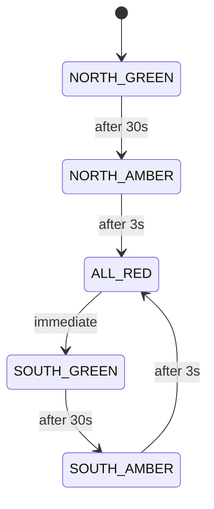

# NF-004: Enhance State Diagram Clarity with Formal Notation

**Requirement ID**: NF-004  
**Title**: Enhance State Diagram Clarity with Formal Notation  
**Priority**: NICE (nice to fix - improves documentation clarity)  
**Severity**: 🟡 **MINOR**  
**Status**: OPEN

---

## Requirement Statement

Complex state diagrams use ASCII art notation, which is:
- Hard to read and maintain
- Lacks transition guard conditions
- Lacks timing annotations

The system **should consider upgrading state diagrams** to formal notation (Mermaid or similar) for improved clarity and maintainability.

---

## Current Example

```
[NORTH GREEN] → [NORTH AMBER] → [ALL RED] → [SOUTH GREEN] → ...
```

---

## Proposed Upgrade (Mermaid)



---

## Affected Requirements

- REQ-005: Mode A and Mode B state diagrams
- REQ-NEW-COLLISION-PREVENTION-1: Conflict zone state machine

---

## Implementation Notes

- **Mermaid**: Markdown-native, renders in GitHub/GitLab
- **Tools**: Draw.io, Lucidchart for more complex diagrams
- **Recommendation**: Mermaid for ASCII-replaceable diagrams

**Effort**: 2–3 hours (optional enhancement; low priority)

---

## Sign-Off

| Role | Status |
| --- | --- |
| Documentation Lead | ⏳ PENDING |

